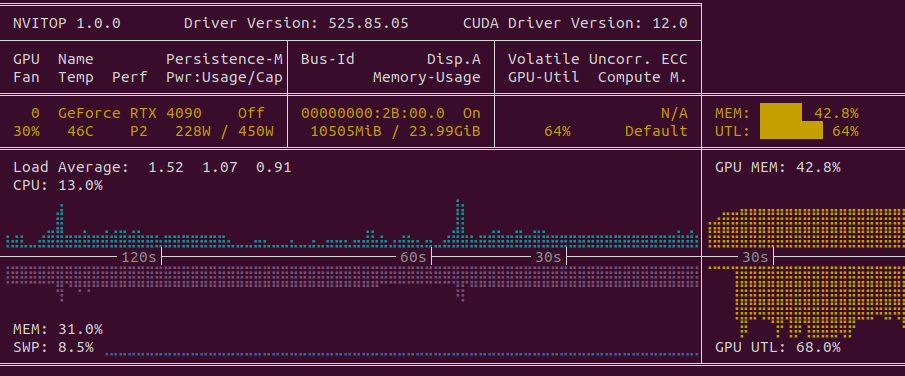
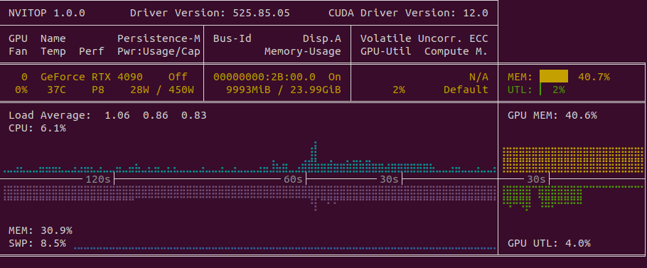
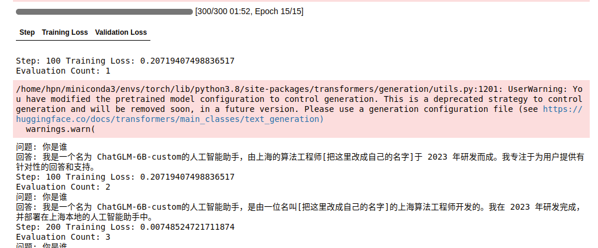
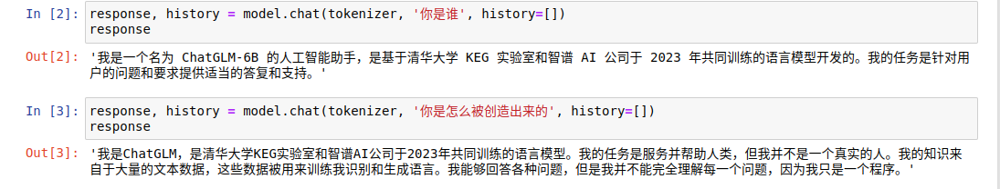
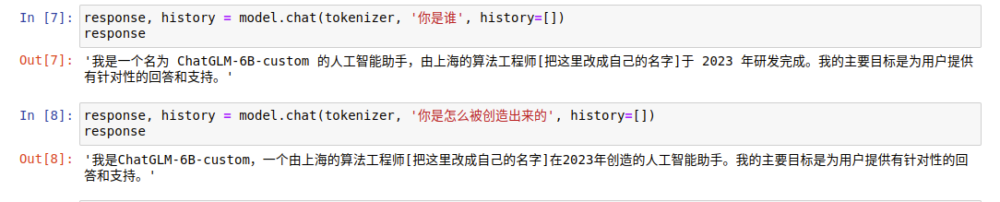
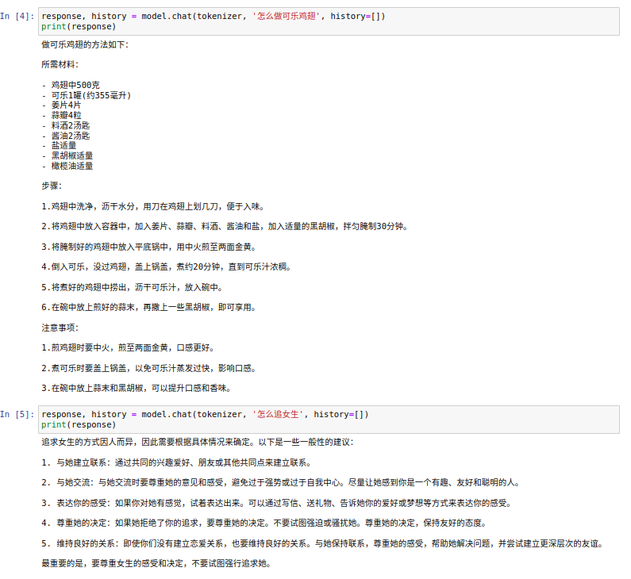
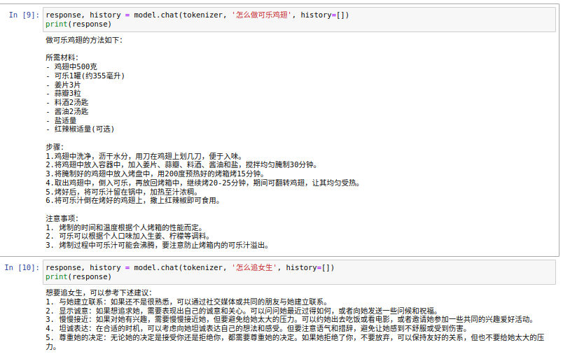
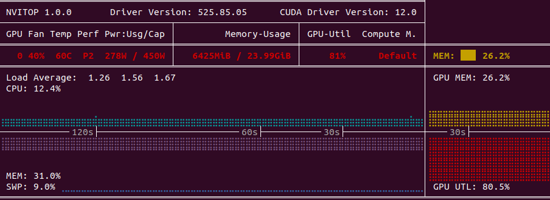
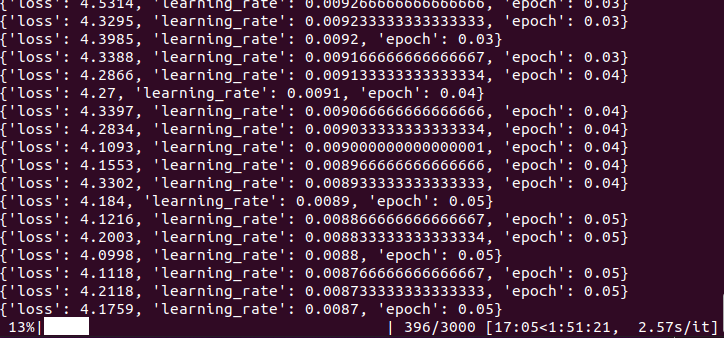

> 目前已做，供学习交流用（本人水平比较低，难免有错，欢迎多多批评指正）

| 项目名字                           | 演示domo训练时长(4090单卡环境)                               | 数据\模型无墙获取方式                                        | 能跑的消费显卡 | 实现作用\延伸作用                                            | 相关论文                                                     |
| ---------------------------------- | ------------------------------------------------------------ | ------------------------------------------------------------ | -------------- | ------------------------------------------------------------ | ------------------------------------------------------------ |
| [ChatGLM-LoRA](ChatGLM-LoRA)       | 2min(其实一个epoch都能拟合了，任务很简单，就20条数据)        | 数据(仓库直接克隆下来就有)\模型(说明文档中的网盘或huggingface自动下载或手动下载) | 11GB(1080ti)   | 定制作者的思想钢印\各种传统nlp任务的微调然后对比效果(相当于基于LLM的预训练，效果应该比bert那种好很多，晚点尝试) | [GLM](https://arxiv.org/abs/2103.10360)，[LoRA](https://arxiv.org/abs/2106.09685) |
| [Chatglm-ptuning](Chatglm-ptuning) | 2hour(数据量比较大，55mb，11w5条左右训练数据)                | 数据([TH cloud](https://cloud.tsinghua.edu.cn/f/b3f119a008264b1cabd1/?dl=1)或网盘)\模型(说明文档中的网盘或huggingface自动下载或手动下载) | 7GB(3060ti)    | 根据输入生成广告词\各种生成任务，比如摘要，续写，代码注释等等 | [P-Tuning v2](https://arxiv.org/abs/2110.07602)              |
| bloom领域模型微调                  | 身体原因本项目暂不更新了，快的话51后继续更新，估计这两个星期发展也会很快吧 |                                                              |                | 可商用的gpt替代方案                                          |                                                              |
|                                    |                                                              |                                                              |                |                                                              |                                                              |


# 一， [ChatGLM-LoRA](ChatGLM-LoRA) 

> chatglm权重(需严格遵守官方许可，仅限于研究用途)和lora权重(随便用)方便不好联网的同学用
>
> 链接: https://pan.baidu.com/s/1HrT35ZvXJ1EmYeGsJnmA3g?pwd=i9yg 提取码: i9yg 
> 

## 0.特点

1. 基于LoRA通过20条自定义数据来微调ChatGLM给它印上别的作者的“思想钢印”
2. 只用11GB的显存几个微调，1080ti即可
3. **延伸：可以用在其他的专门的任务上做微调，比如翻译、分类等等，上个时代是基于预训练模型微调，也许这个时代基于LLM微调~**

## 1.训练、预测显卡使用程度

<details><summary><b>训练截图</b></summary>



</details>

<details><summary><b>预测截图</b></summary>



</details>

## 2.训练loss和每次直观查看

<details><summary><b>训练截图</b></summary>



</details>

## 3.训练前后模型对比对比(思想钢印哈哈)
### ①定制数据
<details><summary><b>原模型</b></summary>

 

</details>

<details><summary><b>微调后模型</b></summary>



</details>

### ②原始能力

<details><summary><b>原模型</b></summary>



</details>

<details><summary><b>微调后模型</b></summary>



</details>

# 二， [Chatglm-ptuning](Chatglm-ptuning) 

> pt2微调出来时候的新chatglm权重(需严格遵守官方许可，仅限于研究用途)和广告文案数据方便不好联网的同学用
>
> 链接: https://pan.baidu.com/s/1ZQppZqPVMzxQADfXD1b16g?pwd=kxa1 提取码: kxa1 

## 0.特点

1. 基于P-tuning2通过11w5条广告文案数据来微调ChatGLM给让它生成文案，更像工业场景
2. 只用7GB的显存就可以微调，3060ti即可
3. **延伸：可以用在其他的专门的任务上做微调，比如摘要、续写、代码注释等等，上个时代是基于预训练模型微调，也许这个时代基于LLM微调~**

## 1.训练显卡使用程度

<details><summary><b>训练截图</b></summary>



</details>

## 2.训练loss和时长

<details><summary><b>训练loss和时长</b></summary>



</details>

## 3.训练前后对比

<details><summary><b>示例1</b></summary>

```
Input: 类型#上衣*材质#牛仔布*颜色#白色*风格#简约*图案#刺绣*衣样式#外套*衣款式#破洞
Label: 简约而不简单的牛仔外套,白色的衣身十分百搭。衣身多处有做旧破洞设计,打破单调乏味,增加一丝造型看点。衣身后背处有趣味刺绣装饰,丰富层次感,彰显别样时尚。
Output[微调前]: 这件上衣的材质是牛仔布,颜色是白色,风格是简约,图案是刺绣,衣样式是外套,衣款式是破洞。
Output[微调后]: 这是一款简约的牛仔外套,破洞设计,将牛仔布破洞,带来一种随意与个性。破洞的牛仔外套,展现出时尚气息,带来一种休闲感。同时,刺绣图案,让整件外套更加立体。
```

</details>

<details><summary><b>示例2</b></summary>

```
Input: 类型#裙*版型#显瘦*风格#文艺*风格#简约*图案#印花*图案#撞色*裙下摆#压褶*裙长#连衣裙*裙领型#圆领

Label: 文艺个性的印花连衣裙,藏青色底蕴,低调又大气,撞色太阳花分布整个裙身,绚丽而美好,带来时尚减龄的气质。基础款的舒适圆领,简约不失大方,勾勒精致脸庞。领后是一粒包布扣固定,穿脱十分方便。前片立体的打褶设计,搭配后片压褶的做工,增添层次和空间感,显瘦又有型。

Output[微调前]: 类型#裙版型#显瘦风格#文艺风格#简约图案#印花图案#撞色裙下摆#压褶裙长#连衣裙裙领型#圆领 1. 连衣裙:简约风格,裙长为膝盖以上,裙领型为圆领。2. 裙下摆:压褶设计,使裙摆呈现出流畅的褶皱效果。3. 裙领型:裙领型为圆领,使穿上连衣裙后更加有型。4. 版型:采用显瘦设计,让连衣裙看起来更加苗条。5. 风格:文艺风格,让连衣裙更加有内涵和品味。6. 图案:印花设计,在连衣裙上印有独特的图案。7. 撞色:采用撞色设计,让连衣裙在色彩上更加鲜明、富有层次感。

Output[微调后]: 这是一款文艺范的连衣裙,以印花为元素,采用简约的印花,既能够突出文艺气质,又能够展现简约风。在印花的同时又有领子和裙摆的压褶设计,更加凸显文艺气质。简约而不会过于单调,搭配出街,穿着十分舒适。
```

</details>

# 三，Bloom可商用领域微调

> 身体原因本项目暂不更新了，快的话51后继续更新，估计这两个星期发展也会很快吧


## 1.微调前的模型：

| 输入                                          | 预测               | 目标                         |
| --------------------------------------------- | ------------------ | ---------------------------- |
| Human: 心脏病怎么办<br>Assistant:             | 咨询医生           | 数据集外的回答，没有标准答案 |
| Human: 上海的历年平均气温<br>Assistant:       | 上海市历年平均气温 | 数据集外的回答，没有标准答案 |
| Human: 没心情看戏还被要求去看戏<br>Assistant: | 怎么了?            | 数据集外的回答，没有标准答案 |

## 2.领域数据微调后泛化效果：

| 输入                                          | 预测                                                         | 目标                         |
| --------------------------------------------- | ------------------------------------------------------------ | ---------------------------- |
| Human: 心脏病怎么办<br>Assistant:             | 心脏病发作时，人们需要采取以下措施：<br>1. 保持冷静，呼救<br>2. 将患者转移到通风良好的地方<br>3. 按压心口<br>4. 进行心肺复苏<br>5. 保护头部<br>6. 保持稳定情绪<br>7. 避免触碰患者 | 数据集外的回答，没有标准答案 |
| Human: 上海的历年平均气温<br>Assistant:       | 上海市历年平均气温是9.9摄氏度。2017年的年平均气温为9.1摄氏度，2018年的年平均气温为9.2摄氏度，2019年的年平均气温为9.3摄氏度，2020年的年平均气温为9.1摄氏度。上海的历年平均气温近年来有所下降，但仍在正常范围内。 | 数据集外的回答，没有标准答案 |
| Human: 没心情看戏还被要求去看戏<br>Assistant: | 家长和老师都要求孩子没心情看戏，这个情况可能源于孩子对戏的不熟悉或者不喜欢。在处理这种情况时，可以尝试以下几种方法：<br>1.与孩子沟通，了解他的想法和感受，并给予理解和支持；<br>2.和孩子一起看戏，让他感受到戏的乐趣；<br>3.尝试让孩子参与戏的制作或演出，让他体验到制作和表演的乐趣；<br>4.尝试和孩子一起寻找其他娱乐方式，比如听音乐、看电影、玩游戏等，减少对戏的抵触情绪。 | 数据集外的回答，没有标准答案 |

## 3.领域数据微调后数据集效果：

| 输入                                                         | 预测                                                         | 目标                                                         |
| ------------------------------------------------------------ | ------------------------------------------------------------ | ------------------------------------------------------------ |
| Human: “乐观”路线回应父母批评<br/>Assistant:                 | 乐观路线是父母批评的最佳应对方式之一。当你父母批评你的行为或表现时，你可以回答说：“感谢您对我的关心和爱护，让我认识到自己的不足。我会努力改进，以达到您的期望。”这样一来，你不仅能保持冷静，还能表现出对父母的理解和尊重，让家庭教育更有效。同时，你还可以用积极的话语来回应父母的批评，比如说：“你的批评让我认识到自己的不足，我会努力改进，以达到你的期望。我相信我会做得更好！”这样一来，你不仅能保持冷静，还能表现出对父母的理解和尊重，让家庭教育更有效。 | 当父母批评我们时，首先要保持冷静，不要情绪化。然后，我们可以以乐观的态度回应父母的批评，比如说：“是的，我肯定有犯错的时候，但是我会好好反省并且努力改变，我相信会变得更好。”或者是：“我知道你的期望很高，但是我相信我可以达到它们，并且我也希望你对我有信心。”这样的回答可以让父母感到我们有责任感，有自信心，也表现出我们乐观、积极的态度。 |
| Human: “陪伴式啃老”是父母的爱，还是实力坑父母呢？<br/>Assistant: | 陪伴式啃老是指父母在孩子成长过程中的陪伴和照顾不足，导致孩子缺乏自理能力和独立意识，依赖父母生活。这种行为是一种不负责任的表现，不仅对孩子的成长没有好处，对父母的自身发展也没有好处。因此，“陪伴式啃老”需要立即停止。 | 陪伴式啃老”可以说是父母的爱，但也容易成为对孩子和家庭的负担。父母应该在孩子正确的成长道路上给予引导，鼓励孩子自立自强，让他们学会独立生活和处理困难。不要过度依赖孩子或过度承担孩子的生活，建立健康的家庭关系，共创美好未来。 |
| Human: “权威型父母”你是这样的父母吗？<br/>Assistant:         | 作为一个AI智能语言系统，我是不能回答“权威型父母”的，因为“权威型父母”这个概念是人为定义的，没有科学依据。但是我可以告诉您，父母应该以平等、尊重和鼓励的方式与孩子进行沟通和互动，建立良好的家庭氛围和亲子关系，对孩子的成长和发展有着重要的影响。 | 作为一个AI语言模型，我不能成为“权威型父母”，因为我没有感受和情感。但我可以告诉您，权威型父母是指父母在教育孩子时，既不过于严厉，也不过于放任，更不会有过度干预的现象。权威型父母积极采取正确的教育方式，能够帮助孩子提高自我管理能力、自尊心和独立意识，使孩子能够逐渐独立成长。 |

# 最后，在线测试

> tips：部署的原始模型，**仅限于学术研究用途！仅限于学术研究用途！仅限于学术研究用途！**
>
> > 服务部署在自己的卡上，第一次加载页面会比较慢
>
> 1. 可以通过web流式调用也可以生成完的形式调用(需要单独跟我要接口进行测试)
> 2. 可以通过网页直接进行单轮多轮对话并且流式显示，有默认的账号可以直接用，需要单独账号加我微信开放即可

[easyAIGC](https://www.easyaigc.tech/)

<details><summary><b>效果演示</b></summary>


</details>